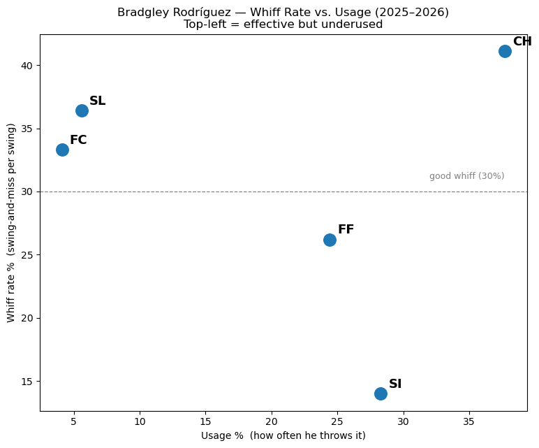

# Pitching Case Study

A public baseball analytics project using Python and Statcast data to analyze MLB pitchers and identify opportunities for player development.

## Project Goal

The purpose of this project is to answer one question:

**How can data be used to make pitchers better?**

Using Statcast data, I analyze:

- Pitch usage
- Whiff rate
- Swing-and-miss ability
- Pitch movement
- Velocity
- Release point
- Pitch sequencing

## Tools

- Python
- PyBaseball
- Pandas
- Matplotlib
- Jupyter Notebook
- GitHub

## Current Project

**Bradley Rodríguez Pitch Analysis**

### Completed
- ✅ Statcast data collection
- ✅ Whiff Rate vs Usage visualization

### Coming Soon
- Pitch movement plot
- Velocity analysis
- Release point visualization
- CSW% analysis
- Pitch sequencing analysis

---

*This project is part of my journey into baseball analytics and player development.*
## First Visualization

